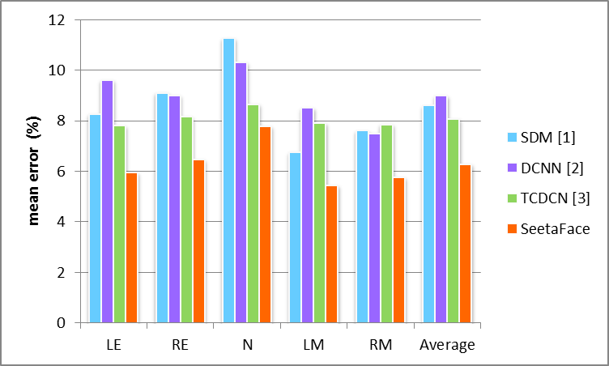

## SeetaFace Alignment

[](../LICENSE)

### Description
Instead of a straightforward application of deep network, SeetaFace Alignment implements a Coarse-to-Fine Auto-encoder
Networks (CFAN) approach, which cascades a few Stacked Auto-encoder Networks (SANs) to progressively approach the accurate locations of the facial landmarks. The algorithm details can be found in our ECCV-2014 paper [CFAN](#citation). The released SeetaFace Alignment is trained with more than 23,000 images and can accurately detect five facial landmarks, i.e., two eye centers, nose tip and two mouth corners. Please note that this implementation is slightly different from that described in the corresponding paper: only two stages are cascaded for the purpose of higher speed (more than 200 fps on I7 desktop CPU). 

SeetaFace Alignment is implemented for running on CPU with no dependence on any third-party libraries. Currently it is only tested on Windows, but it does not include any Windows-specific headers. Versions for more platforms, e.g., Linux, will be released in the future. The open source is released under BSD-2 license (see [LICENSE](../LICENSE)), which means the codes can be used freely for both acedemic purpose and industrial products.

### Performance Evaluation

To evaluate the performance of SeetaFace Alignment, experiments are conducted on [AFLW](http://lrs.icg.tugraz.at/research/aflw/), following the protocol published in [3]. The mean alignment errors normalized by the inter-ocular distance are shown in the following figure. As you can see, our SeetaFace Alignment achieves better accuracy than comparative methods.



Where LE, RE, N, LM, RM denote the left eye center, the right eye center, the nose tip, left mouth corner and right mouth corner respectively.

> [1] Xuehan Xiong, Fernando De la Torre. Supervised descent method and its applications to face alignment. CVPR 2013

> [2] Yi Sun, Xiaogang Wang, Xiaoou Tang. Deep Convolutional Network Cascade for Facial Point Detection. CVPR 2013

> [3] Zhanpeng Zhang, Ping Luo, Chen Change Loy, Xiaoou Tang. Facial Landmark Detection by Deep Multi-task Learning. ECCV 2014

As for speed, it takes about 5 milliseconds per face to predict the 5 facial points, given a face bounding box reported by SeetaFace Detector, running on a single Intel 3.4GHz i7-3770 CPU with no parallel computing.

### Build Shared Lib with Visual Studio

1. Create a dll project: New Project -> Visual C++ -> Win32 Console Application -> DLL.
2. *(Optional) Create and switch to x64 platform.*
3. Add [header files](./include): all `*.h` files in `include`.
4. Add [source files](./src): all `*.cpp` files in `src` except for those in `src/test`.
5. Define `SEETA_EXPORTS` macro: (Project) Properities -> Configuration Properties -> C/C++ -> Preprocessor -> Preprocessor Definitions.
6. Build.

**A Visual Studio 2013 solution is provided in the subdirectory [examples](./examples).**

### Build in Linux

``` 
mkdir build
``` 
copy the "face detection lib" and "face_detection.h" to the directory "build" for building the test example.

```
cd build
cmake ..
make
``` 

If everything goes fine, move on to test the program. Note: you should copy the face detetion model [seeta_fd_frontal_v1.0.bin](../FaceDetection/model/seeta_fd_frontal_v1.0.bin) to the directory "build" before testing.

```
cd ..
./build/fa_test
``` 
The alignment results are stored in "result.jpg".

### How to run SeetaFace Alignment

This version is developed to detect five facial landmarks, i.e., two eyes' centers, nose tip and two mouth corners.
To detect these facial landmarks, one should first instantiate an object of `seeta::FaceAlignment` with path of the model file.

```c++
seeta::FaceAlignment landmark_detector("seeta_fa_v1.1.bin");
```

Then one can call `PointDetectLandmarks(ImageData gray_im, FaceInfo face_info, FacialLandmark *points)` to detect landmarks.

```c++
seeta::ImageData image_data(width, height);
image_data.data = image_data_buf;
image_data.num_channels = 1;
seeta::FaceInfo face_bbox;
seeta::FacialLandmark points[5];
landmark_detector.PointDetectLandmarks(image_data, face_bbox, points);
```

Where **image_data** denotes an input gray image, **face_bbox** is the face bouding box detected by [Seeta - Face Detection] (https://github.com/seetaface/SeetaFaceEngine/tree/master/FaceDetection),
The landmarks detection results are returned in **points**. An example can be found in file [face_alignment_test.cpp](./src/test/face_alignment_test.cpp).

### Citation

If you use the code in your work, please consider citing our work as follows:

    @inproceedings{zhang2014coarse,
    title={Coarse-to-fine auto-encoder networks (cfan) for real-time face alignment},
    author={Zhang, Jie and Shan, Shiguang and Kan, Meina and Chen, Xilin},
    booktitle={European Conference on Computer Vision},
    year={2014},
    organization={Springer}}

### License

SeetaFace Alignment is released under the [BSD 2-Clause license](../LICENSE).