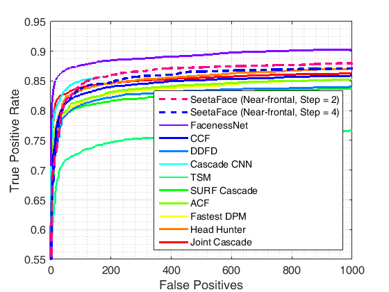

## SeetaFace Detection

[](../LICENSE)

### Brief Description

SeetaFace Detection is an implementation of **Fu**nnel-**St**ructured cascade, which is designed for real-time multi-view face detection.
FuSt aims at a good trade-off between accuracy and speed by using a coarse-to-fine structure.
It consists of multiple view-specific fast LAB cascade classifiers at early stages, followed by coarse Multilayer Perceptron (MLP) cascades at later stages.
The final stage is one unified fine MLP cascade, processing all proposed windows in a centralized style.

The open source version of FuSt includes codes for face detection as well as a model for detecting near-frontal faces
(also with reasonable capability to detect non-frontal faces), which is trained with approximately 200K face images.
Please note that the implementation is slightly different from that described in the corresponding [paper](#citation):
(1) The fine MLP cascade uses SURF feature instead of SIFT; (2) Non-Maximal Suprresion (NMS) is added;
(3) Landmark prediction is replaced by bounding box regression (For facial landmark localization,
see [SeetaFace Alignment](https://github.com/seetaface/SeetaFaceEngine/tree/master/FaceAlignment)).

The code is written in C++ without dependence on any third-party libraries.
Currently it is only tested on Windows, but it does not include any Windows-specific headers.
Parallelization is used partially, and more will be introduced in the future.

### Performance Evaluation

The discrete ROC curve on FDDB of the SeetaFace Detector is shown below (curves of other methods are obtained from
[FDDB official site](http://vis-www.cs.umass.edu/fddb/results.html)).
To achieve the results in this figure with SeetaFace Detector, the minimum size of faces to detect should be set to 20,
step of sliding window is set to 2 or 4 (as shown in the legend), and the scaling factor is set to 0.8 (or 1.25 if defined as that used in OpenCV).



The speed comparison is given in the following table, taking VGA input images(640x480) as example.
The step of sliding window of SeetaFace detector is set to 4, with scaling factor 0.8.
Cascade CNN uses an image pyramid with a scaling factor of 0.7 (or 1.414 as defined in OpenCV).
The reported speed of SeetaFace Detector is tested on a single 3.40GHz i7-3770 CPU, and those of other methods
are cited directrly from the corresponding paper (Briefly, the CPU speed of Cascade CNN is tested on a 2.0 GHz CPU core.
The GPU speed is tested on NVIDIA Titan Black GPU.).

Detector | Min Face Size | Speed on CPU | Speed on GPU
-------- | ------------- | ------------ | ------------
SeetaFace Detector  | 40x40 | 16.0 FPS | n/a
SeetaFace Detector | 80x80 | 55.0 FPS | n/a
Cascade CNN [1] | 80x80 | 9.1 FPS | 100 FPS
FacenessNet [2] | 80x80 | n/a | 20 FPS

> [1] Haoxiang Li, Zhe Lin, Xiaohui Shen, Jonathan Brandt, and Gang Hua. A convolutional neural network cascade for face detection. CVPR 2015.

> [2] Shuo Yang, Ping Luo, Chen Change Loy, and Xiaoou Tang. From Facial Parts Responses to Face Detection: A Deep Learning Approach. ICCV 2015.

### How to Build Shared Lib with Visual Studio

1. Create a dll project: New Project -> Visual C++ -> Win32 Console Application -> DLL.
2. *(Optional) Create and switch to x64 platform.*
3. Add additional include directories: (Project) Properities -> Configuration Properties -> C/C++ -> General -> Additional Include Directories.
4. Add source files: all `*.cpp` files in `src` except for those in `src/test`.
5. Define `SEETA_EXPORTS` macro: (Project) Properities -> Configuration Properties -> C/C++ -> Preprocessor -> Preprocessor Definitions.
6. *(Optional) Switch to Intel C++ (for better code optimization).*
7. *(Optional) Enable OpenMP support: (Project) Properities -> Configuration Properties -> C/C++ -> Language -> Open MP Support (or ... C/C++ -> Language [Intel C++] -> OpenMP Support). Define `USE_OPENMP` macro if necessary.*
8. Build.

**A Visual Studio 2013 solution is provided in the subdirectory [examples](./examples).**

### How to Build in Linux
- Build
```shell
mkdir build
cd build
cmake ..
make -j${nproc}
```

- Run demo
```shell
./build/facedet_test image_file model/seeta_fd_frontal_v1.0.bin
```

### How to run SeetaFace Detector

The class for face detection is included in `seeta` namespace. To detect faces on an image, one should first
instantiate an object of `seeta::FaceDetection` with path of the model file.

```c++
seeta::FaceDetection face_detector("seeta_fd_frontal_v1.0.bin");
```

After an image is read and converted to grayscale, one needs to pack the image data with `seeta::ImageData`.
Note that the pixel values should stored in a continuous 1D array in row-major style.

```c++
seeta::ImageData img_data(width, height);
img_data.data = img_data_buf;
```

Then one can call `Detect()` to detect faces, which will be returned as a `vector` of [`seeta::FaceInfo`](./include/common.h).

```c++
std::vector<seeta::FaceInfo> faces = face_detector.Detect(img_data);
```

See an [example test file](./src/test/facedetection_test.cpp) for details.

### How to Configure the SeetaFace Detector

* Set minimum and maximum size of faces to detect (Default: 20, Not Limited)
  - `face_detector.SetMinFaceSize(size);`
  - `face_detector.SetMaxFaceSize(size);`
* Set step size of sliding window (Default: 4)
  - `face_detector.SetWindowStep(step_x, step_y);`
* Set scaling factor of image pyramid (0 < `factor` < 1, Default: 0.8)
  - `face_detector.SetImagePyramidScaleFactor(factor);`
* Set score threshold of detected faces (Default: 2.0)
  - `face_detector.SetScoreThresh(thresh);`

See comments in the [header file](./include/face_detection.h) for details.

### Citation

If you find SeetaFace Detection (FuSt) useful in your research work, please consider citing:

    @article{wu2016fust,
      Author = {Wu, Shuzhe and Kan, Meina and He, Zhenliang and Shan, Shiguang and Chen, Xilin},
      Journal = {Neurocomputing (under review)},
      Title = {Funnel-Structured Cascade for Multi-View Face Detection with Alignment-Awareness},
      Year = {2016}
    }
    
The arXiv preprint of the paper can be found at [http://arxiv.org/abs/1609.07304](http://arxiv.org/abs/1609.07304).

### License

SeetaFace Detection is released under the [BSD 2-Clause license](../LICENSE).
